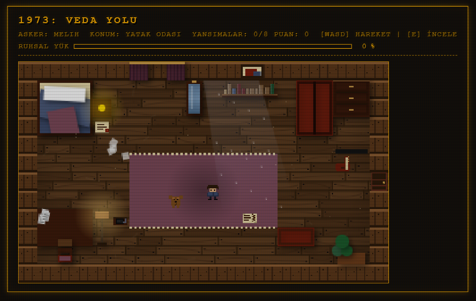
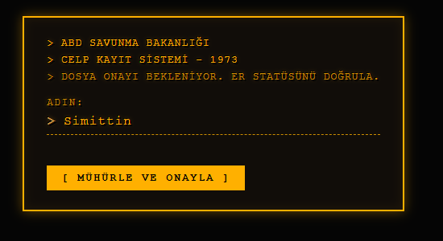
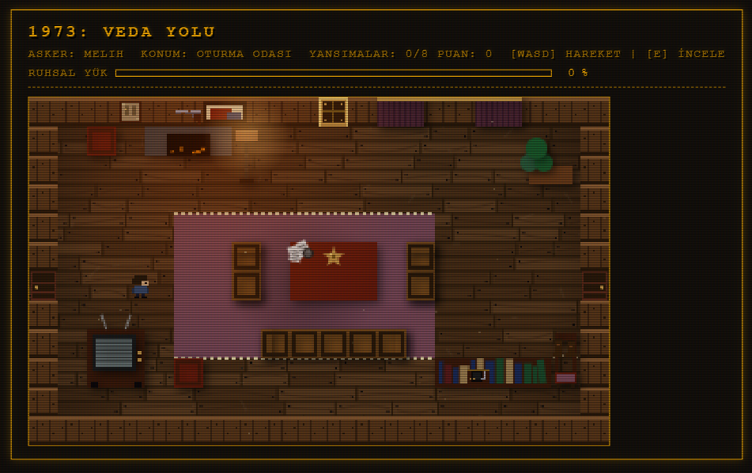
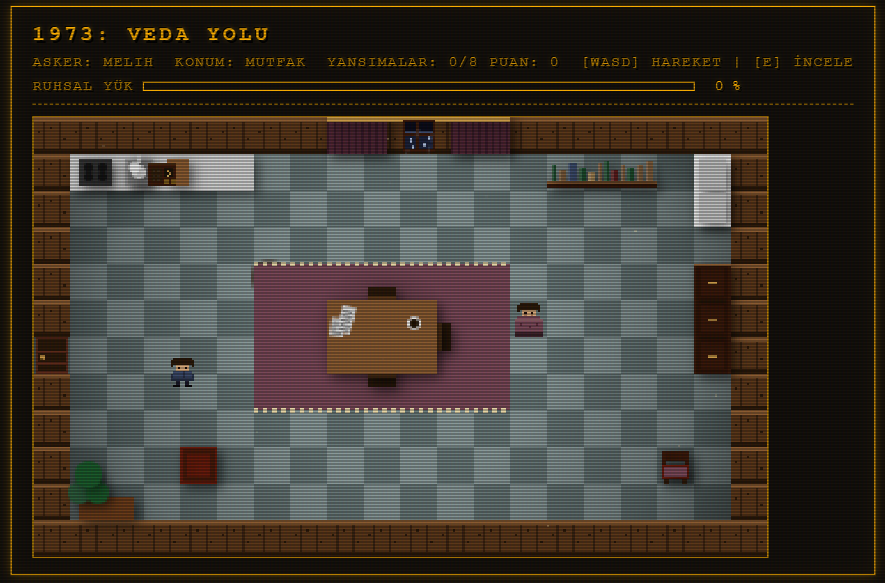
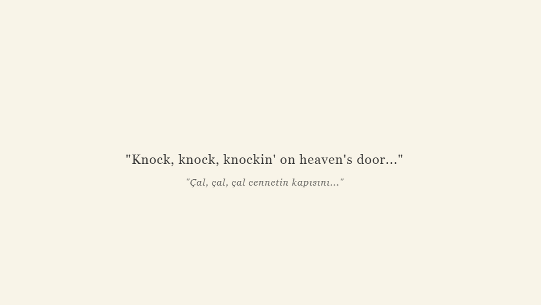
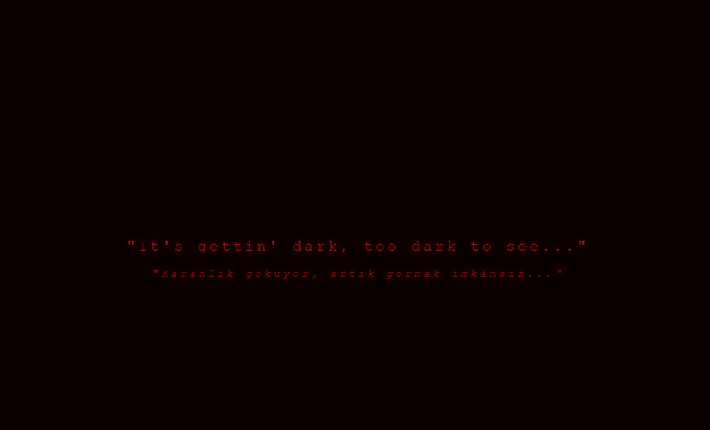
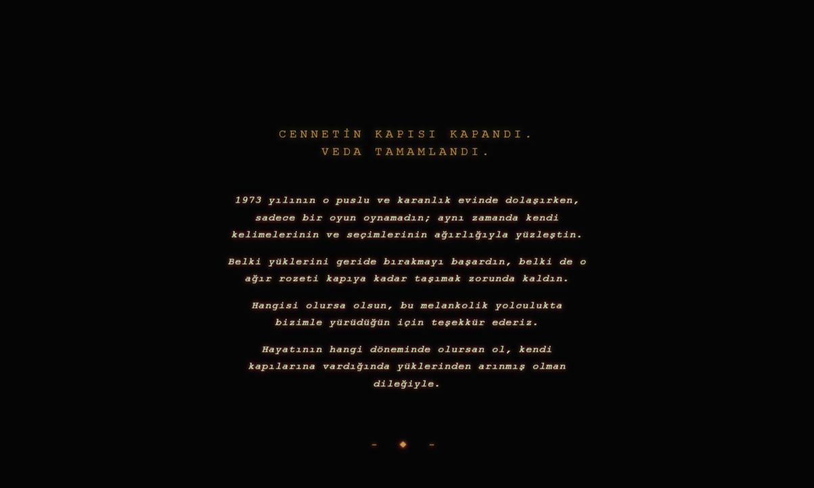

# 1973: Veda Yolu

> *"Anne, bu rozeti çıkar üstümden — artık taşıyamıyorum."*
> — Bob Dylan, *Knockin' on Heaven's Door* (1973)

[🇹🇷 Türkçe](#türkçe) · [🇬🇧 English](#english)

---

<a name="türkçe"></a>

## Proje Hakkında

**1973: Veda Yolu**, oyuncunun Vietnam Savaşı'na gönderilmek üzere evini terk eden bir askeri canlandırdığı, anlatı odaklı 2B piksel-art bir oyundur. Evdeki her nesne bir anıyı taşır. Her konuşma, **Yük** adı verilen görünmez bir ağırlığı artırır ya da hafifletir. Kapıya ulaştığında taşıdıkların, kim olduğunu belirler.

Oyun, **CSE 358 Yapay Zekaya Giriş** dersi yaratıcı projesi kapsamında geliştirilmiştir. İki bağımsız üretici yapay zeka tekniği — bir LLM ve bir duygu sınıflandırıcı — hem oyun mekaniğinin hem de duygusal anlatının merkezine yerleştirilmiştir.



---

## Sanatçı Beyanı

"Knockin' on Heaven's Door" şarkısı, Sam Peckinpah'ın *Pat Garrett & Billy the Kid* (1973) filmindeki ölmekte olan bir şerif için yazıldı. Aynı yıl Paris Barış Anlaşmaları imzalandı, ABD Vietnam'daki muharip rolünü resmi olarak sonlandırdı; ancak 58.000 askerin geri dönmediği bir kuşağın ağırlığı geride kaldı. Dylan o ağırlığı dört dize ve bir melodiye sığdırdı.

Bu proje Dylan'ın hikâyesini yeniden anlatmıyor. Onun sorusunu ödünç alıyor: *Kapıdan geçmeden önce ne bırakırsın?*

**Yük** mekaniği bu sorunun oynanabilir biçimidir. Duygu analizi, sözcüklerinin duygusal gerçeğini okur. Dil modeli, geride bıraktığın nesnelere ses verir. Söylenmemiş acının ağırlığıyla ezildiğinde yavaş yürürsün; bıraktığında özgürce ilerlersin. Kapı herkes için aynıdır. Oraya nasıl vardığın değil.

---

## Yapay Zeka Teknikleri

### 1. Büyük Dil Modeli — Google Gemini

| | |
|---|---|
| **Model** | `gemma-3-27b-it` |
| **API** | Google Generative Language API |
| **Rol** | Tüm oyun içi diyalogların gerçek zamanlı üretimi |
| **Dosyalar** | [`src/ai/gemini.js`](src/ai/gemini.js), [`src/ai/prompts.js`](src/ai/prompts.js) |

İki farklı sistem promptu kullanılır:

- **`inner_voice`** — Askerin iç sesi. Nesnenin kişisel anlamını irdeler; oyuncuya açık uçlu veya seçmeli sorular sorar.
- **`mom`** — Oyuncunun annesi. Oyuncunun itiraflarına sıcaklık ve yargısızlıkla karşılık verir.

Yanıtlar **şema doğrulamalı JSON** olarak istenir: `reply`, `score`, `label`, `is_final`, `choices`. Sistem promptu **mevcut Yük seviyesini içerir** — yükü ağır bir oyuncu daha karanlık ve melankolik yanıtlar alır. Bozuk JSON dönerse regex tabanlı fallback parser devreye girer.

### 2. Duygu Analizi — Transformers.js (BERT)

| | |
|---|---|
| **Model** | `Xenova/bert-base-multilingual-uncased-sentiment` (ONNX) |
| **Çalıştığı yer** | Tamamen tarayıcıda — sunucu / API çağrısı yok |
| **Rol** | Oyuncu metninin duygusal değerini sınıflandırır (1–5 yıldız) |
| **Dosya** | [`src/ai/sentiment.js`](src/ai/sentiment.js) |

Duygu puanı **asimetrik biçimde** Yük deltasına eşlenir — olumsuz yanıtlar, olumlu yanıtların hafifletebildiğinden orantısız fazla ağırlık taşır. Bu, gerçek yas psikolojisinin yansımasıdır:

| Duygu | Yıldız | Yük Δ |
|-------|:------:|:-----:|
| Çok olumsuz | ⭐ | **+28** |
| Olumsuz | ⭐⭐ | **+14** |
| Nötr | ⭐⭐⭐ | **+4** |
| Olumlu | ⭐⭐⭐⭐ | **−4** |
| Çok olumlu | ⭐⭐⭐⭐⭐ | **−8** |

Model ilk yüklemede tarayıcıya indirilir (~90 MB), sonrasında cache'lenir.

### İki Tekniğin Etkileşimi

```
Oyuncu yanıt yazar
        │
        ▼
┌───────────────────┐
│  Transformers.js  │  ← tamamen tarayıcıda
│  Sentiment BERT   │
└────────┬──────────┘
         │ yıldız puanı (1–5)
         ▼
┌───────────────────┐
│    Yük Durumu     │  ← 0–100 duygusal yük (asimetrik Δ)
└────────┬──────────┘
         │ yük skoru sistem promptuna eklenir
         ▼
┌───────────────────┐
│   Gemini LLM      │  ← bir sonraki diyalog turu
│   (Gemma-3-27B)   │
└────────┬──────────┘
         │ yanıt + sıradaki soru
         ▼
   Oyuncu yanıtı görür;
   hareket hızı = taban × max(0.15, 1 − yük/100)
```

İki teknik birbirini besler: BERT olmadan LLM bir chatbot olur; LLM olmadan BERT bir ölçer. Birlikte çalıştıklarında oyuncunun duygusal dürüstlüğü hem hikâyenin diline hem bedenin hareketine yansır.

---

## Oyun Sonu Müziği (Hibrit Sistem)

Oyun sonu müziği iki katmanlı bir sistemle üretilir:

1. **Replicate MusicGen** *(opsiyonel — token gerektirir)* — `meta/musicgen` modeli üzerinden Yük skoruna göre 55 saniyelik özgün bir parça üretir.
2. **Prosedürel Web Audio sentezi** *(varsayılan)* — Token yoksa veya API başarısız olursa, Bob Dylan'ın "Knockin' on Heaven's Door" melodisi G/D/Am7/C akor dizisi, harmonika simülasyonu ve lo-fi vinil cızırtısıyla **JavaScript'te gerçek zamanlı sentezlenir**.

Her iki katman da Yük skoruna göre tonalite değiştirir — `< 50` ise majör/huzurlu, `≥ 50` ise minör/sürünen.

> **Not:** Replicate MusicGen ücretli bir servistir (~$0.06/üretim). Token tanımlı değilse oyun sessizce prosedürel sentezle devam eder; herhangi bir özellik kaybı olmaz.

---

## Oyun Akışı

1. **Kayıt** — Askeri CELP terminali üzerinden isim girişi
2. **Giriş** — Kısa anlatı: savaş, askere çağrı, son gece
3. **Keşif** — WASD ile evi (yatak odası, mutfak, salon) dolaş
4. **Yansıma** — 8 etkileşimli nesneye yaklaşıp `E` tuşuna bas
5. **Son** — 7 yansımayı tamamla, ön kapıya yönel

İki son, Yük skoruna göre belirlenir (eşik: 50):

| Son | Koşul | Deneyim |
|-----|-------|---------|
| **Hafif** | Yük < 50 | Özgürce kapıya yürü; sakin folk jenerik |
| **Ağır** | Yük ≥ 50 | Sürünen adımlar; ekran kırmızıya döner; glitch efektleri |

---

## Ekran Görüntüleri

**Kayıt & Keşif**

| | |
|:---:|:---:|
|  |  |
| *ABD Savunma Bakanlığı CELP terminali — 1973* | *Oturma odası — Amerikan bayrağı ve aile nesneleri* |
|  |  |
| *Mutfak — günlük hayatın izleri* | *Yatak odası — Ruhsal Yük çubuğu sol üstte* |

**İki Son**

| Hafif Son — Yük < 50 | Ağır Son — Yük ≥ 50 |
|:---:|:---:|
|  |  |
| *"Knock, knock, knockin' on heaven's door..."* | *"It's gettin' dark, too dark to see..."* |

**Jenerik**



---

## Kurulum

### Gereksinimler

- Node.js ≥ 18
- Google Gemini API anahtarı — [aistudio.google.com](https://aistudio.google.com/)
- *(Opsiyonel)* Replicate API token — AI müzik üretimi için

### Adımlar

```bash
git clone https://github.com/Simittin/aiknock.git
cd aiknock
npm install
cp .env.example .env
```

`.env` dosyasını düzenle:

```env
VITE_GEMINI_API_KEY=gemini_api_anahtarın
REPLICATE_API_TOKEN=replicate_tokenın   # opsiyonel
```

Geliştirme sunucusunu başlat:

```bash
npm run dev
```

Tarayıcıda `http://localhost:5173` adresini aç.

### Production Build

```bash
npm run build
npm run preview
```

### Debug Komutları

Tarayıcı konsolunda:

```js
cheat.lightEnd()   // hafif sona atla (düşük yük)
cheat.heavyEnd()   // ağır sona atla (yüksek yük)
```

---

## Teknik Mimari

```
index.html              Oyun kabuğu, CRT katmanı, modal arayüzler
src/
  main.js               Başlatma, Yük arayüzü, müzik ön üretimi
  ai/
    gemini.js           Gemini API istemcisi, JSON şema doğrulama
    sentiment.js        Transformers.js yükleyici, BERT çıkarımı
    prompts.js          inner_voice / mom sistem promptları
    env-loader.js       API anahtar okuma (Vite + statik sunucu uyumlu)
  engine/
    game.js             Ana oyun döngüsü (requestAnimationFrame)
    renderer.js         Canvas 2D çizim (320×192 → 2× ölçek)
    collision.js        Tile tabanlı AABB çarpışma
    input.js            Klavye durum yönetimi
    player.js           Hareket, Yük'e bağlı hız formülü
  objects/              8 etkileşimli nesne + 5 paskalya yumurtası
  rooms/                Oda haritaları (yatak odası, mutfak, salon)
  state/
    burden.js           Yük birikimi, eşik olayları
    scores.js           Nesne başına diyalog geçmişi
    profile.js          Oyuncu adı
  audio/
    ambient.js          Prosedürel yağmur (2 katmanlı LFO), drone
    sfx.js              Adımlar, etkileşim sesleri, yük spike kalp atışı
    ending-music.js     Replicate MusicGen + prosedürel folk fallback
  ui/
    dialog.js           Modal sistem, yazı animasyonu
    intro.js            Anlatı giriş sahnesi
    name-prompt.js      CELP kayıt arayüzü
    finale.js           Son sahne, jenerik
    lore.js             Tarihi bağlam katmanları
  assets/
    sprites.js          Piksel sprite tanımları
styles/
  main.css              CRT scanline, fosfor yeşili, Yük kırmızısı
```

**Teknoloji:** Vanilla JavaScript, HTML5 Canvas, Web Audio API, Vite.

---

## Bağımlılıklar

| Paket | Sürüm | Amaç |
|-------|:-----:|------|
| `vite` | ^6.x | Build aracı ve geliştirme sunucusu |
| `@xenova/transformers` | ^2.x | Tarayıcı içi BERT duygu modeli (ONNX) |

**Harici API'ler:**

| API | Zorunlu | Kullanım |
|-----|:-------:|----------|
| Google Gemini (`gemma-3-27b-it`) | ✅ | NPC diyalog üretimi |
| Replicate MusicGen | ❌ | AI bitiş müziği (yoksa prosedürel) |

---

## Tarihi Bağlam

Proje 1973'te geçer — Dylan'ın şarkıyı yazdığı, *Pat Garrett & Billy the Kid*'in çekildiği ve Paris Barış Anlaşmaları'nın ABD'nin Vietnam'daki muharip rolüne resmi (ancak içi boş) bir son verdiği yıl.

Oyun doğrudan savaşı anlatmıyor. Ayrılıştan önceki son geceyi anlatıyor — raftaki nesneleri, anneye söylenemeyen sözleri, bir kuşağın taşımak zorunda kaldığı ağırlığı. Yük mekaniği, asimetrik duygu eşlemesi ve iki son, izole oyun-tasarımı kararları değil; o döneme dair bir argümanın yapısal biçimleridir.

---

## Akademik Bütünlük

Tüm AI araçları, modeller ve API'ler bu README'de açıkça listelenmiştir:

- **Google Gemini** (`gemma-3-27b-it`) — diyalog
- **Xenova/bert-base-multilingual-uncased-sentiment** — duygu sınıflandırma
- **Meta MusicGen** (Replicate proxy üzerinden, opsiyonel) — bitiş müziği

Yaratıcı vizyon, mimari kararlar ve felsefi yansıma ekibe aittir; AI ürettiği materyali ekibin yönlendirmesi ve seçimi anlamlandırır.

---

## Ekip

| İsim | Öğrenci No | Rol |
|------|:----------:|-----|
| **Ahmet Melih Bostancıeri** | 20220808063 | Teknik altyapı, AI entegrasyonu, tarihsel araştırma, ses sistemi |
| **Egemen Çamözü** | 20220808076 | Görsel kimlik, sprite tasarımı, anlatı, iç ses diyalogları, prompt mühendisliği |
| **Yunus Emre Balcı** | 20220808026 | Yaratıcı yönelim, UI/UX, CRT estetiği, ses konsepti, anne diyalogları |

---

## Lisans

CSE 358 Yapay Zekaya Giriş dersi kapsamında geliştirilmiştir, Bahar 2025–2026.

---
---

<a name="english"></a>

# 1973: Veda Yolu (Farewell Road) — English

> *"Mama, take this badge off of me — I can't use it anymore."*
> — Bob Dylan, *Knockin' on Heaven's Door* (1973)

## About

**1973: Veda Yolu** is a narrative-driven 2D pixel-art game in which the player embodies a soldier preparing to leave home for the Vietnam War. Every object in the house carries a memory. Every conversation adds — or eases — an invisible weight called **Burden**. When you finally reach the door, what you carry decides who you become.

Built as a **CSE 358 Introduction to Artificial Intelligence** creative project, the game places two distinct generative AI techniques — an LLM and a sentiment classifier — at the heart of both gameplay and emotional storytelling.


## Artist Statement

"Knockin' on Heaven's Door" was written for a dying sheriff in Sam Peckinpah's *Pat Garrett & Billy the Kid* (1973). The same year, the Paris Peace Accords formally ended the United States' combat role in Vietnam — leaving behind a generation, and 58,000 who never returned. Dylan condensed that weight into four lines and a melody.

This project does not retell Dylan's story. It borrows his question: *What do you put down before you walk through the door?*

The **Burden** mechanic is the answer made playable. Sentiment analysis reads the emotional truth of your words. The LLM gives voice to the objects you leave behind. Heavy with unspoken grief, you move slowly. Let go, and you walk freely. The door is the same for everyone. How you arrive at it is not.

## AI Techniques

### 1. Large Language Model — Google Gemini
- **Model:** `gemma-3-27b-it` (Google Generative Language API)
- **Role:** Real-time generation of all in-game dialogue
- **Modes:** `inner_voice` (the soldier's internal monologue) and `mom` (the player's mother)
- Schema-validated JSON output; system prompt encodes current Burden so tone shifts dynamically.

### 2. Sentiment Analysis — Transformers.js (BERT)
- **Model:** `Xenova/bert-base-multilingual-uncased-sentiment` (ONNX, runs entirely in-browser)
- **Role:** Classifies emotional valence of player text (1–5 stars) → asymmetric Burden delta

| Sentiment | Stars | Burden Δ |
|-----------|:-----:|:--------:|
| Very negative | ⭐ | +28 |
| Negative | ⭐⭐ | +14 |
| Neutral | ⭐⭐⭐ | +4 |
| Positive | ⭐⭐⭐⭐ | −4 |
| Very positive | ⭐⭐⭐⭐⭐ | −8 |

### Interaction Loop

```
Player input → BERT (in-browser) → Burden state (asymmetric Δ)
            → Gemini LLM (Burden injected into system prompt)
            → next dialogue turn
            → movement speed = base × max(0.15, 1 − burden/100)
```

Neither technique alone produces the experience. Together, the player's emotional honesty shapes both the language of the story and the body's movement.

## Ending Music — Hybrid System

1. **Replicate MusicGen** *(optional, requires token)* — generates a 55-second piece via `meta/musicgen` based on Burden score.
2. **Procedural Web Audio synthesis** *(default)* — when no token is set, Bob Dylan's "Knockin' on Heaven's Door" melody is synthesized in JavaScript using G/D/Am7/C progression, harmonica simulation, and lo-fi vinyl crackle.

Both layers shift tonality with Burden — major/peaceful below 50, minor/dragging above. Replicate MusicGen costs roughly $0.06 per generation; without a token the game silently uses procedural synthesis with no loss of functionality.

## Gameplay

1. **Registration** — name input via military CELP terminal
2. **Prologue** — narrative setup: war, conscription, the last night
3. **Exploration** — navigate the home (bedroom, kitchen, living room) with WASD
4. **Reflection** — press `E` near 8 interactive objects to start dialogue
5. **Ending** — complete 7 reflections, approach the front door

| Ending | Condition | Experience |
|--------|-----------|------------|
| **Light** | Burden < 50 | Walk freely to the door; peaceful folk credits |
| **Heavy** | Burden ≥ 50 | Slow, agonized shuffle; screen turns red; glitch effects |

**Screenshots**

| | |
|:---:|:---:|
|  |  |
| *U.S. Army CELP terminal — 1973* | *Living room — the flag, the objects left behind* |
|  |  |
| *Kitchen — traces of everyday life* | *Bedroom — Burden bar visible top-left* |

| Light Ending — Burden < 50 | Heavy Ending — Burden ≥ 50 |
|:---:|:---:|
|  |  |
| *"Knock, knock, knockin' on heaven's door..."* | *"It's gettin' dark, too dark to see..."* |


## Setup

**Prerequisites:** Node.js ≥ 18, a Google Gemini API key, optional Replicate token.

```bash
git clone https://github.com/Simittin/aiknock.git
cd aiknock
npm install
cp .env.example .env
```

Edit `.env`:

```env
VITE_GEMINI_API_KEY=your_gemini_api_key
REPLICATE_API_TOKEN=your_replicate_token   # optional
```

```bash
npm run dev          # development server
npm run build        # production build
npm run preview      # preview production build
```

Open `http://localhost:5173`.

**Debug:**

```js
cheat.lightEnd()   // skip to light ending
cheat.heavyEnd()   // skip to heavy ending
```

## Technical Architecture

Vanilla JavaScript, HTML5 Canvas, Web Audio API, Vite. No game framework — the engine is built from scratch (tile-based 320×192 native resolution, 2× scaled). See the Turkish section above for the full file tree.

## Dependencies

| Package | Version | Purpose |
|---------|:-------:|---------|
| `vite` | ^6.x | Build tool & dev server |
| `@xenova/transformers` | ^2.x | In-browser BERT sentiment model (ONNX) |

| API | Required | Usage |
|-----|:--------:|-------|
| Google Gemini (`gemma-3-27b-it`) | ✅ | NPC dialogue |
| Replicate MusicGen | ❌ | AI ending music (procedural fallback otherwise) |

## Historical Context

The game is set in 1973 — the year Dylan wrote the song, *Pat Garrett & Billy the Kid* was filmed, and the Paris Peace Accords formally ended America's combat role in Vietnam. The game is not about the war directly; it is about the last night before departure — the objects on a shelf, the words left unsaid to a mother, the weight a generation was asked to carry. The Burden mechanic, asymmetric sentiment mapping, and two endings are not isolated game-design choices but structural arguments about that era.

## Academic Integrity

All AI tools, models, and APIs used:

- **Google Gemini** (`gemma-3-27b-it`) — dialogue generation
- **Xenova/bert-base-multilingual-uncased-sentiment** — sentiment classification
- **Meta MusicGen** (via Replicate, optional) — ending music

Creative vision, architectural decisions, and philosophical reflection are the team's own. AI generates material; the team curates and directs.

## Team

| Name | Student ID | Role |
|------|:----------:|------|
| **Ahmet Melih Bostancıeri** | 20220808063 | Technical architecture, AI integration, historical research, audio systems |
| **Egemen Çamözü** | 20220808076 | Visual identity, sprite design, narrative, inner voice dialogues, prompt engineering |
| **Yunus Emre Balcı** | 20220808026 | Creative direction, UI/UX, CRT aesthetic, audio concept, mother dialogues |

## License

Developed for CSE 358 Introduction to Artificial Intelligence, Spring 2025–2026.
